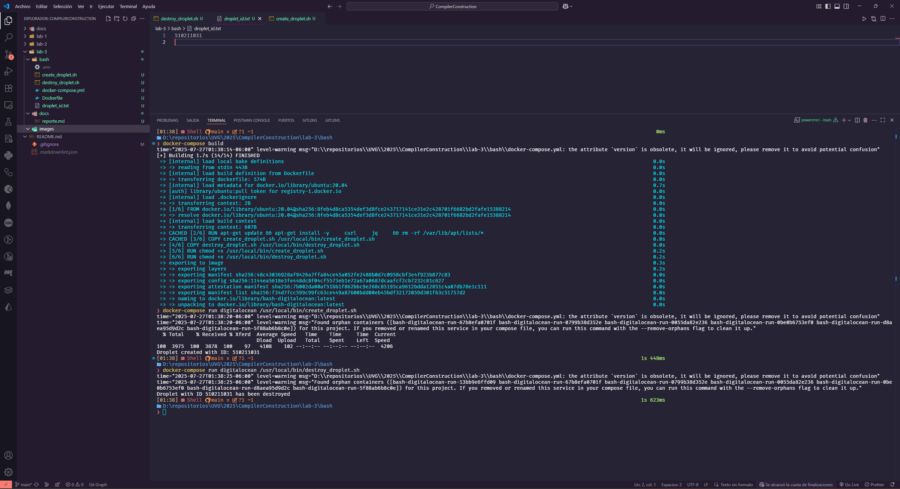
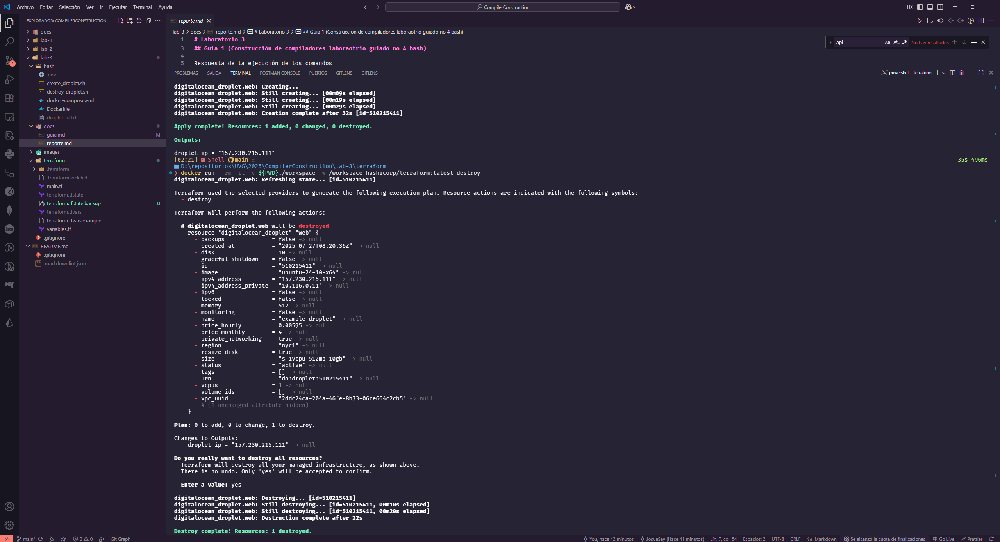
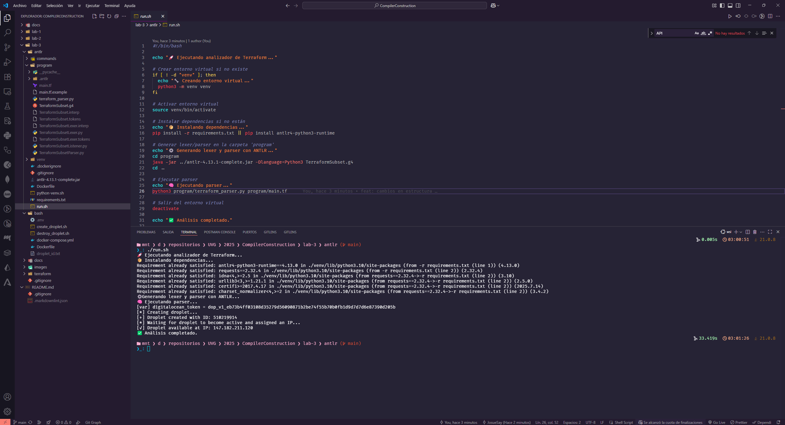
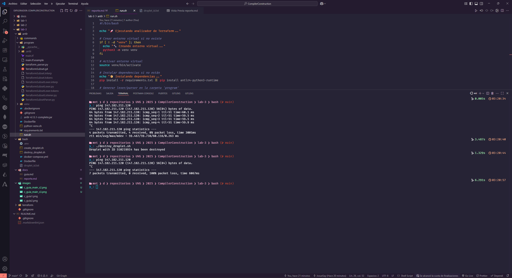
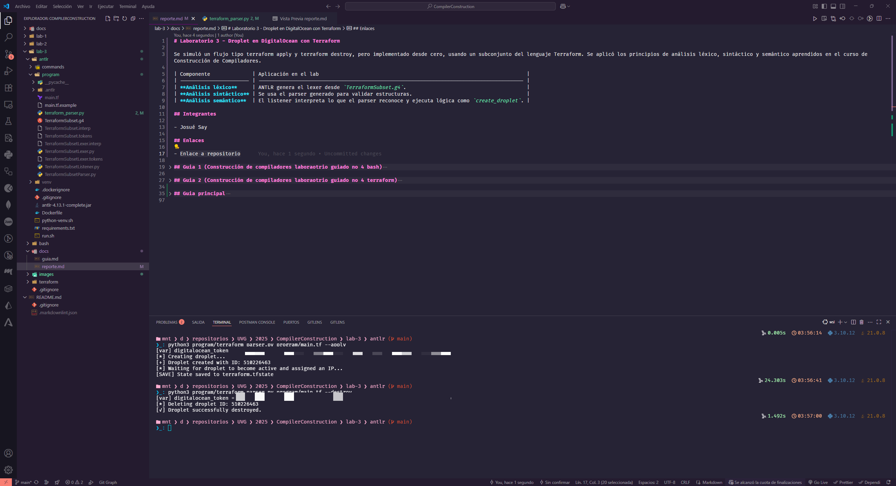

<!-- ---
header-includes:
  - \usepackage{amsmath}
  - \usepackage{amssymb}
  - \usepackage{fontspec}
  - \setmainfont{FiraCode Nerd Font}
  - \setmonofont{FiraCode Nerd Font Mono}
  - \usepackage{setspace}
  - \setstretch{1.5}
  - \usepackage{fvextra}
  - \DefineVerbatimEnvironment{Highlighting}{Verbatim}{breaklines,commandchars=\\\{\}}
  - \hypersetup{colorlinks=true, linkcolor=blue, urlcolor=blue}
geometry: top=0.67in, bottom=0.67in, left=0.85in, right=0.85in
--- -->

# Laboratorio 3 - Droplet en DigitalOcean con Terraform

Se simuló un flujo tipo terraform apply y terraform destroy, pero implementado desde cero, usando un subconjunto del lenguaje Terraform. Se aplicó los principios de análisis léxico, sintáctico y semántico aprendidos en el curso de Construcción de Compiladores.

| Componente              | Aplicación en el lab                                                                     |
| ----------------------- | ---------------------------------------------------------------------------------------- |
| **Análisis léxico**     | ANTLR genera el lexer desde `TerraformSubset.g4`.                                        |
| **Análisis sintáctico** | Se usa el parser generado para validar estructuras.                                      |
| **Análisis semántico**  | El listener interpreta lo que el parser reconoce y ejecuta lógica como `create_droplet`. |

## Integrantes

- Josué Say

## Enlaces

- [Enlace a repositorio](https://github.com/JosueSay/CompilerConstruction/blob/main/lab-3/docs/reporte.md)
- [Enlace a ejecución del código](https://youtu.be/q2vaE1Nqa9M)

## Guia 1 (Construcción de compiladores laboraotrio guiado no 4 bash)

Se creó y destruyó un Droplet en DigitalOcean manualmente usando Bash + Docker.

**Respuesta de la ejecución de los comandos:**



## Guia 2 (Construcción de compiladores laboraotrio guiado no 4 terraform)

Se utilizó la herramienta Terraform oficial para crear un droplet. Se usaron las versiones de docker porque local en windows no me funcionó (xd). Para esto se puede revisar la [guia](https://github.com/JosueSay/CompilerConstruction/blob/main/lab-3/docs/guia.md) realizada.

**Respuesta de la ejecución de los comandos:**



## Guia principal

Se diseñó, parseó y ejecutó un subconjunto del lenguaje Terraform usando ANTLR.

Se creó un archivo adicional `main.tf.example`.  

Para comenzar, copia su contenido a un nuevo archivo `main.tf` con el siguiente comando:

```bash
cp main.tf.example main.tf
```

Luego, edita el archivo `main.tf` y reemplaza en la **línea 20** el valor defaul por el API Key real (usada en los pasos previos para la carpeta bash y transform) para más información se puede consultar la [guia](https://github.com/JosueSay/CompilerConstruction/blob/main/lab-3/docs/guia.md) hecha para este repositorio:

```bash
default     = "DO_API_TOKEN"
```

Además, se creó un archivo `run.sh` que automatiza el proceso de ejecución posterior.

Para ejecutarlo, utiliza:

```bash
./run.sh
```

Esto ejecutará todo el proceso solicitado.



Al hacer un `ping` y ejecutar el destroy al `droplet` dado el nuevo id:



### ¿Qué se implementó?

- Una gramática `TerraformSubset.g4` que define sintaxis válida: `provider`, `variable`, `resource`, `output`.
- Se generaron clases en Python con ANTLR para lexer/parser.
- Se usó un listener (`TerraformApplyListener`) para construir un analizador semántico que:
  - Extrae variables.
  - Valida el provider.
  - Interpreta recursos.
  - Aplica (crea) o destruye droplets dependiendo de la bandera CLI `--apply` o `--destroy`.
- Se agregó soporte para parámetros desde la línea de comandos (`--apply` y `--destroy`) para simular `terraform apply` y `terraform destroy`.
- Se implementó la función `saveState(...)` para guardar un archivo `terraform.tfstate` en formato JSON, que almacena el ID, nombre e IP pública del droplet creado.
- La función `create_droplet(...)` fue modificada para devolver tanto la IP como el ID del droplet, permitiendo guardar su estado.
- Se implementó la función `destroyDroplet(...)` que lee el archivo `.tfstate`, extrae el ID del droplet y lo elimina utilizando la API de DigitalOcean.
- El archivo de entrada `.tf` ahora es interpretado con una lógica condicional que, según el parámetro proporcionado, ejecuta la creación (`apply`) o eliminación (`destroy`) del recurso definido.

### Archivo `.tfstate`

- Implementaste lógica para guardar un state como Terraform:
  - Con ID, nombre e IP del droplet creado.
  - Permitió luego eliminarlo con `--destroy`.

### Comandos

```bash
cd antlr/
python3 program/terraform_parser.py program/main.tf --apply
python3 program/terraform_parser.py program/main.tf --destroy
```


